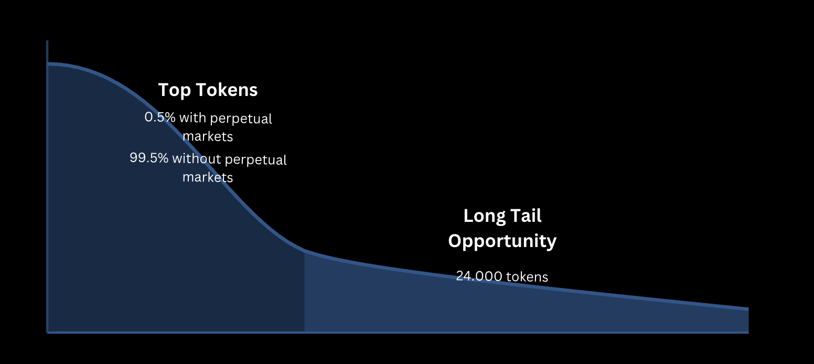

# GTX Perpetual DEX

## Overview

GTX Perp DEX is a **fully decentralized and permissionless exchange** designed for perpetual futures trading. It enables users to **create and trade** perpetual contracts with **high transparency, security, and decentralization**.

---

## **Problem & Solution**

### Problem

Traditional perpetual DEXes and centralized exchanges encounter several issues:

- **Centralization risks**: Dependence on centralized or semi-centralized order execution systems.

- **Limited market offerings**: Market listings are dictated by DEX DAOs or CEX policies, often involving fees or governance approvals.

- **Liquidity fragmentation**: Smaller assets face challenges in achieving deep liquidity due to inefficient market-making processes.

- **Slow and costly execution**: On-chain order books can be both expensive and slow, negatively affecting the trader experience.

### **Solution**

GTX Perp DEX introduces a **fully decentralized, permissionless trading infrastructure**:

- **Permissionless market creation**: Anyone can list new perpetual markets, even for new or small-cap assets (as long as they exist on a DEX for price data).
- **Decentralized order execution**: A permissionless keeper network ensures fair and efficient trade execution.
- **Curator vaults**: Liquidity is managed dynamically by curators to optimize risk-adjusted returns.
- **Advanced oracle mechanisms**: zkTLS and AVS technology provide secure and tamper-proof price feeds.
- **Scalability & efficiency**: Optimized smart contracts enable fast and low-cost trading, improving user experience.
- **Opportunity for long-tail assets**: Unlike CEXes and traditional DEXes, GTX allows markets for niche assets, unlocking liquidity for smaller tokens.



### **The Power of Permissionless Liquidity**

GTX follows the model of permissionless liquidity, similar to leading DeFi protocols:

| Protocol     | Liquidity |
| ------------ | --------- |
| **Uniswap**  | \$4.14B   |
| **Balancer** | \$743M    |
| **Curve**    | \$1.84B   |
| **Pancake**  | \$1.629B  |

By allowing **any asset** with price data to have a perpetual market, GTX provides **greater access and liquidity** for traders and market makers.

---

## **Key Features**

- **Permissionless Market Creation** - Anyone can deploy and list perpetual markets without approval.
- **Decentralized Order Execution** - Powered by a permissionless keeper network where participants earn execution fees.
- **Advanced Oracle Mechanism** - Utilizes AVS (Actively Validated Service) and zkTLS for secure and tamper-proof price feeds.
- **Curator Vaults** - A decentralized vault system managed by curators to ensure efficient risk management and optimal liquidity strategies.
- **Scalability & Efficiency** - Optimized smart contracts to facilitate fast and low-cost trading.
- **Longtail Market Support** - Enables trading of less liquid, niche assets by leveraging deep liquidity aggregation and risk-managed vaults.

---

## **Architecture**


The GTX Perp Dex architecture consists of several key layers:

1. **Protocol Layer** - The foundation of the exchange, managing markets, vaults, and order execution.
2. **Handler Layer** - Dedicated smart contracts for handling orders, deposits, withdrawals, and positions.
3. **Trading Infrastructure** - The on-chain CLOB system enabling permissionless perpetual trading.
4. **Oracle System** - Uses zkTLS and AVS technology to provide trustless price data.
5. **Curator Mechanism** - Decentralized vault management by curators ensuring optimal risk-adjusted returns.
6. **Keeper Network** - A decentralized network of keepers responsible for order execution and liquidation processes.

---

## **Components**

GTX Perpetual consists of multiple components that enable a permissionless perpetual trading experience. Below are the key repositories:

1. **Perpetual DEX**  
   The main trading platform for permissionless perpetual contracts, allowing leveraged trading with on-chain liquidity.  
   🔗 **Repo:** [Perpetual DEX](https://github.com/Great-Trading-eXperience/perpetual-dex)

2. **Oracle AVS**  
   Securely fetches off-chain data using zkTLS and EigenLayer middleware, ensuring reliable mark prices for perpetual markets.  
   🔗 **Repo:** [Oracle AVS](https://github.com/Great-Trading-eXperience/oracle-avs)
   🔗 **Details:** [Oracle AVS README](https://github.com/Great-Trading-eXperience/oracle-avs/blob/main/README.md)

3. **Perpetual Indexer**  
   Indexing service that processes and structures blockchain data for efficient market analytics and historical data queries.  
   🔗 **Repo:** [Perpetual Indexer](https://github.com/Great-Trading-eXperience/perpetual-indexer)

---

## **Deployed Contracts**

| Contract         | Address                                    |
| ---------------- | ------------------------------------------ |
| Data Store       | 0x012289D4954b667Fb1bd55445b6250b1eED6C0f1 |
| Market Factory   | 0xeBA6ECa6cBf9098D7076D3a06577B45dE90113E1 |
| Oracle           | 0xD8A8f5C1e6fC685409c94aF2e335e1421cBd09a0 |
| Order Vault      | 0xD7b397039e36F9b665A32D24d150Ee1f0029d10a |
| Deposit Vault    | 0x823F91041c1CeCDc65Ee8A7335f471ac1A08cAf0 |
| Withdraw Vault   | 0x7BA5c9AAbD99423e809B0a1B5Caf186736e96C79 |
| Order Handler    | 0x3c1706B1Df304F1e039B824c1229bfbD5D0557d5 |
| Position Handler | 0x53A33652df1F2cf81C63e5D6ECD116732d5387f9 |
| Market Handler   | 0xa9200367C2245F312061462f815a2AAe2A0a3249 |
| Deposit Handler  | 0xE50914672560E18B2f5cE311a4557880dF05000c |
| Withdraw Handler | 0x727fc0daB102e8cF9De79bD0f26B03994A58611F |
| Router           | 0x8cB82FfCA2eA57B29aD137b9a8cDCa718233ff96 |
| Curator Registry | 0x6E7E29c33CdC76b8e758EdfC71a2f256256e1C42 |
| Curator Factory  | 0x2cB90f0d8A09b589bAfdBE8797cdB538E412135C |
| Vault Factory    | 0x52EF58ff7156F9cB525A578Ea09c1Eb1EDB60dc6 |

---

### **Deployment Scripts**

#### **1. Deploy Smart Contracts**

```sh
forge script script/DeployCore.s.sol --rpc-url $RPC_URL --private-key $PRIVATE_KEY --broadcast
```

#### **2. Token Management**

```sh
forge script script/DeployTokens.s.sol --rpc-url $RPC_URL --private-key $PRIVATE_KEY --broadcast
```

```sh
forge script script/AddTokensToOracle.s.sol --rpc-url $RPC_URL --private-key $PRIVATE_KEY --broadcast
```

```sh
forge script script/UpdateTokensPriceOnOracle.s.sol --rpc-url $RPC_URL --private-key $PRIVATE_KEY --broadcast
```

#### **3. Market Creation**

```sh
forge script script/CreateMarket.s.sol --rpc-url $RPC_URL --private-key $PRIVATE_KEY --broadcast
```

#### **4. Order Execution & Management**

```sh
forge script script/CreateOrder.s.sol --rpc-url $RPC_URL --private-key $PRIVATE_KEY --broadcast
```

```sh
forge script script/ExecuteOrder.s.sol --rpc-url $RPC_URL --private-key $PRIVATE_KEY --broadcast
```

```sh
forge script script/CancelOrder.s.sol --rpc-url $RPC_URL --private-key $PRIVATE_KEY --broadcast
```

#### **5. Deposit & Withdrawals**

```sh
forge script script/CreateDeposit.s.sol --rpc-url $RPC_URL --private-key $PRIVATE_KEY --broadcast
```

```sh
forge script script/ExecuteDeposit.s.sol --rpc-url $RPC_URL --private-key $PRIVATE_KEY --broadcast
```

```sh
forge script script/CancelDeposit.s.sol --rpc-url $RPC_URL --private-key $PRIVATE_KEY --broadcast
```

```sh
forge script script/CreateWithdraw.s.sol --rpc-url $RPC_URL --private-key $PRIVATE_KEY --broadcast
```

```sh
forge script script/ExecuteWithdraw.s.sol --rpc-url $RPC_URL --private-key $PRIVATE_KEY --broadcast
```

```sh
forge script script/CancelWithdraw.s.sol --rpc-url $RPC_URL --private-key $PRIVATE_KEY --broadcast
```

#### **6. Liquidation & Risk Management**

```sh
forge script script/LiquidatePosition.s.sol --rpc-url $RPC_URL --private-key $PRIVATE_KEY --broadcast
```

#### **7. Curator Vault Management**

```sh
forge script script/DeployCurator.s.sol --rpc-url $RPC_URL --private-key $PRIVATE_KEY --broadcast
```

```sh
forge script script/DepositToCuratorVaults.s.sol --rpc-url $RPC_URL --private-key $PRIVATE_KEY --broadcast
```

---

## **License**

GTX is released under the **MIT License**.

For more details, visit our [documentation](https://your-docs-link.com) or join the discussion on [Discord](https://discord.gg/yourcommunity).
