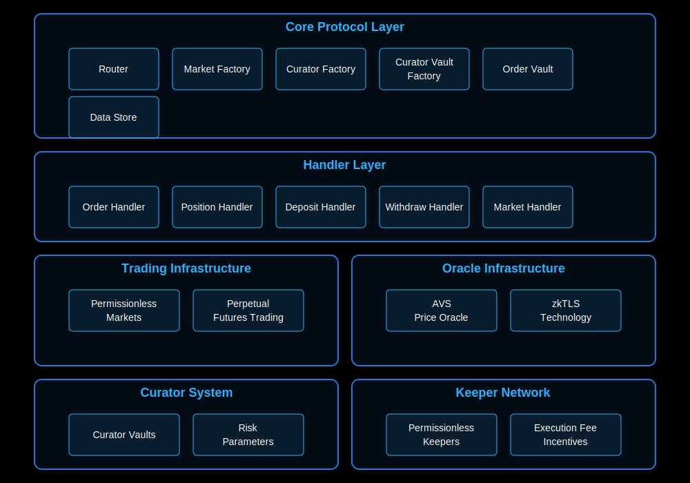

# Overview

The GTX Perp Dex is a revolutionary decentralized exchange for perpetual futures trading that emphasizes true decentralization and permissionless access.

# Deployed Contracts
- DATA_STORE_ADDRESS=0x3654E562a54891a02A1D67966109f746d13E1Eca
- MARKET_FACTORY_ADDRESS=0x22156b8e1dC92Ef0e91A27Ff2D008f3cC0c7fA27
- ORACLE_ADDRESS=0x6f665ed670B033898f2cCF3c6fFA4793fD8a7E88
- ORDER_VAULT_ADDRESS=0x3fBCb48c857b1eA07F722801E2EF4D7E0e61Ba2D
- DEPOSIT_VAULT_ADDRESS=0x2e45D737B1d3Ca3C6Fb4cB82193E0e3D7444e4BD
- WITHDRAW_VAULT_ADDRESS=0x31a84300f4C047565719e67f85974bF2995B5060
- ORDER_HANDLER_ADDRESS=0x6E717FC853D8B2932B09dfd0C717E65FEBFc9662
- POSITION_HANDLER_ADDRESS=0x8c3aFb63c7c4B342a3baeA2D9ae1FcFaDFbc9391
- MARKET_HANDLER_ADDRESS=0x51C1CEfa826fE96D54096d6A0D40Bc440328123c
- DEPOSIT_HANDLER_ADDRESS=0xF573E0745C3FA02b4A6739446C34C16dE49fED52
- WITHDRAW_HANDLER_ADDRESS=0xd63A674760E1f3f6FEb1a319B44715B71Aa58DD0
- MARKET_FACTORY_ADDRESS=0x22156b8e1dC92Ef0e91A27Ff2D008f3cC0c7fA27
- ROUTER_ADDRESS=0x2e505C38656AE7e6B1134F48b0DaF6f725A6EaEB
- CURATOR_REGISTRY_ADDRESS=0x75f1D5455405E2C27354bd407Fc25Bf444167215
- CURATOR_FACTORY_ADDRESS=0xEf4a9Fe522993a5CC66Ce63356D1A6c128F2986F
- VAULT_FACTORY_ADDRESS=0xe3524D92b54d89b980eA01cb842047E18D2De6FC

# Key Features
- **Fully permissionless token listing**: Anyone can deploy and list their own tokens for perpetual futures trading without requiring approval
- **Decentralized execution**: The protocol is powered by a permissionless keeper network where anyone can become a keeper to execute orders and earn execution fees
- **Innovative price oracle**: Mark prices are secured through AVS (Actively Validated Service) and zkTLS technology, ensuring reliable and manipulation-resistant price feeds while maintaining decentralization
- **Curator Vaults**: Curator Vaults are a new way to manage and grow your crypto portfolio. They are a collection of vaults that are managed by a curator. The curator is a trusted entity that is responsible for managing the vaults and maintaining risk parameters to ensure the safety of user funds through careful monitoring and adjustment.

# Architecture

The GTX Perp Dex architecture consists of several key layers:

1. **Core Protocol Layer**: Contains the fundamental smart contracts that power the protocol including Router, Market Factory, Curator Factory, Curator Vault Factory, Order Vault and Data Store.

2. **Handler Layer**: Specialized contracts that handle different protocol operations like Order Handler, Position Handler, Deposit Handler, Withdraw Handler and Market Handler.

3. **Trading Infrastructure**: Enables permissionless markets and perpetual futures trading functionality.

4. **Oracle Infrastructure**: Leverages AVS Price Oracle and zkTLS technology for secure and decentralized price feeds.

5. **Curator System**: Manages Curator Vaults and risk parameters for protocol safety.

6. **Keeper Network**: Permissionless network of keepers incentivized through execution fees to process protocol operations.

# Scripts

## 1. Deploy Tokens

forge script script/DeployTokens.s.sol --rpc-url $RPC_URL --private-key $PRIVATE_KEY --broadcast

## 1. Deploy Core

forge script script/DeployCore.s.sol --rpc-url $RPC_URL --private-key $PRIVATE_KEY --broadcast

# 2. Add Tokens to Oracle

forge script script/AddTokensToOracle.s.sol --rpc-url $RPC_URL --private-key $PRIVATE_KEY --broadcast

# 3. Set initial prices

forge script script/UpdateTokensPriceOnOracle.s.sol --rpc-url $RPC_URL --private-key $PRIVATE_KEY --broadcast

## 4. Create Market

forge script script/CreateMarket.s.sol --rpc-url $RPC_URL --private-key $PRIVATE_KEY --broadcast

## 5. Create Deposit

forge script script/CreateDeposit.s.sol --rpc-url $RPC_URL --private-key $PRIVATE_KEY --broadcast

## 6. Execute Deposit

forge script script/ExecuteDeposit.s.sol --rpc-url $RPC_URL --private-key $PRIVATE_KEY --broadcast

## 7. Create Order

forge script script/CreateOrder.s.sol --rpc-url $RPC_URL --private-key $PRIVATE_KEY --broadcast

## 8. Execute Order

forge script script/ExecuteOrder.s.sol --rpc-url $RPC_URL --private-key $PRIVATE_KEY --broadcast

## 9. Liquidate Position

forge script script/LiquidatePosition.s.sol --rpc-url $RPC_URL --private-key $PRIVATE_KEY --broadcast

## 10. Cancel Order

forge script script/CancelOrder.s.sol --rpc-url $RPC_URL --private-key $PRIVATE_KEY --broadcast

## 10. Cancel Deposit

forge script script/CancelDeposit.s.sol --rpc-url $RPC_URL --private-key $PRIVATE_KEY --broadcast

## 11. Create Withdraw

forge script script/CreateWithdraw.s.sol --rpc-url $RPC_URL --private-key $PRIVATE_KEY --broadcast

## 12. Execute Withdraw

forge script script/ExecuteWithdraw.s.sol --rpc-url $RPC_URL --private-key $PRIVATE_KEY --broadcast

## 13. Cancel Withdraw

forge script script/CancelWithdraw.s.sol --rpc-url $RPC_URL --private-key $PRIVATE_KEY --broadcast

## 14. Deploy Curator

forge script script/DeployCurator.s.sol --rpc-url $RPC_URL --private-key $PRIVATE_KEY --broadcast

## 15. Deposit to Curator Vaults

forge script script/DepositToCuratorVaults.s.sol --rpc-url $RPC_URL --private-key $PRIVATE_KEY --broadcast